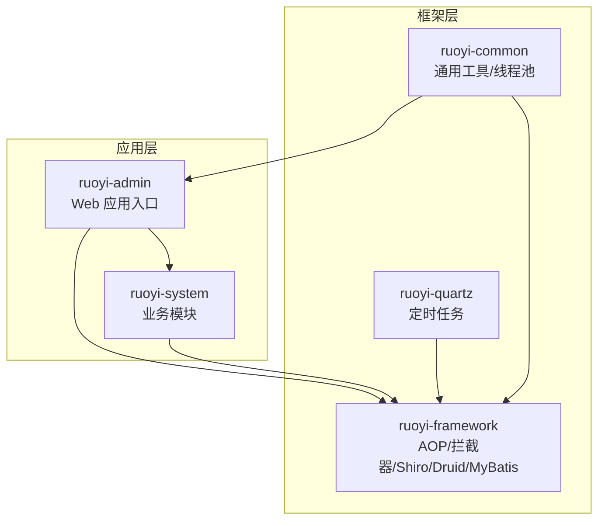
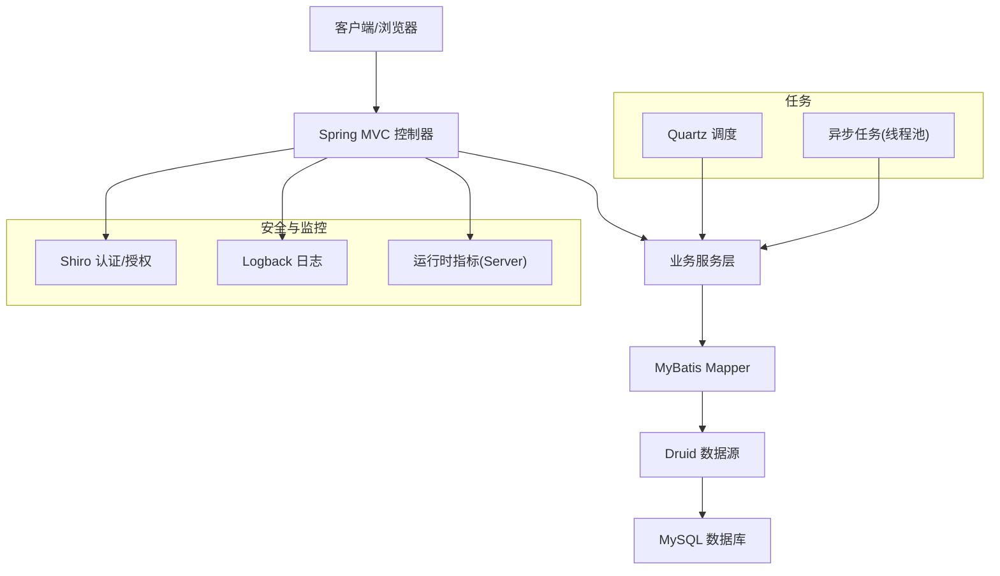
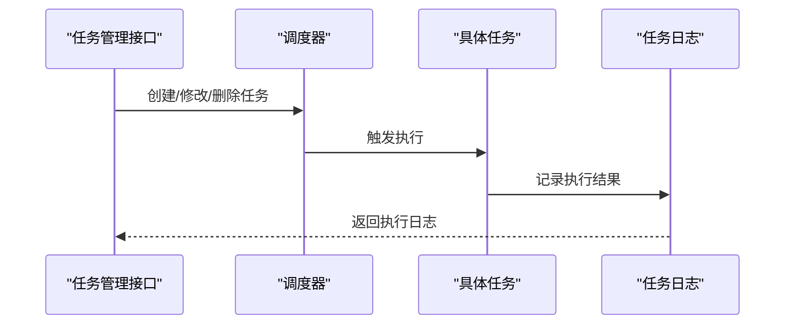
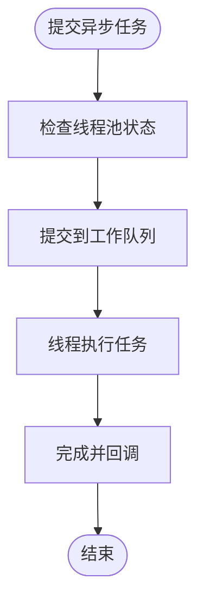
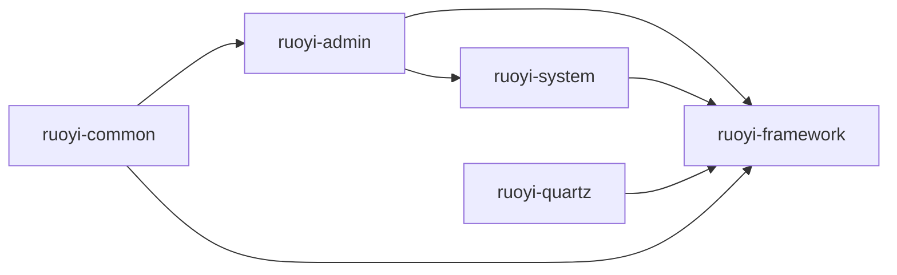

# 部署与运维

<cite>
**本文引用的文件**
- [RuoYiApplication.java](file://GenShin/RuoYi-master/ruoyi-admin/src/main/java/com/ruoyi/RuoYiApplication.java)
- [application.yml](file://GenShin/RuoYi-master/ruoyi-admin/src/main/resources/application.yml)
- [application-druid.yml](file://GenShin/RuoYi-master/ruoyi-admin/src/main/resources/application-druid.yml)
- [logback.xml](file://GenShin/RuoYi-master/ruoyi-admin/src/main/resources/logback.xml)
- [DruidConfig.java](file://GenShin/RuoYi-master/ruoyi-framework/src/main/java/com/ruoyi/framework/config/DruidConfig.java)
- [DruidProperties.java](file://GenShin/RuoYi-master/ruoyi-framework/src/main/java/com/ruoyi/framework/config/properties/DruidProperties.java)
- [MyBatisConfig.java](file://GenShin/RuoYi-master/ruoyi-framework/src/main/java/com/ruoyi/framework/config/MyBatisConfig.java)
- [ScheduleConfig.java](file://GenShin/RuoYi-master/ruoyi-quartz/src/main/java/com/ruoyi/quartz/config/ScheduleConfig.java)
- [SysJobController.java](file://GenShin/RuoYi-master/ruoyi-quartz/src/main/java/com/ruoyi/quartz/controller/SysJobController.java)
- [SysJob.java](file://GenShin/RuoYi-master/ruoyi-quartz/src/main/java/com/ruoyi/quartz/domain/SysJob.java)
- [SysJobLog.java](file://GenShin/RuoYi-master/ruoyi-quartz/src/main/java/com/ruoyi/quartz/domain/SysJobLog.java)
- [SysJobMapper.java](file://GenShin/RuoYi-master/ruoyi-quartz/src/main/java/com/ruoyi/quartz/mapper/SysJobMapper.java)
- [SysJobLogMapper.java](file://GenShin/RuoYi-master/ruoyi-quartz/src/main/java/com/ruoyi/quartz/mapper/SysJobLogMapper.java)
- [AsyncManager.java](file://GenShin/RuoYi-master/ruoyi-framework/src/main/java/com/ruoyi/framework/manager/AsyncManager.java)
- [AsyncFactory.java](file://GenShin/RuoYi-master/ruoyi-framework/src/main/java/com/ruoyi/framework/manager/factory/AsyncFactory.java)
- [ThreadPoolConfig.java](file://GenShin/RuoYi-master/ruoyi-common/src/main/java/com/ruoyi/common/config/thread/ThreadPoolConfig.java)
- [GlobalExceptionHandler.java](file://GenShin/RuoYi-master/ruoyi-framework/src/main/java/com/ruoyi/framework/web/exception/GlobalExceptionHandler.java)
- [Server.java](file://GenShin/RuoYi-master/ruoyi-framework/src/main/java/com/ruoyi/framework/web/domain/server/Server.java)
- [SysLoginService.java](file://GenShin/RuoYi-master/ruoyi-framework/src/main/java/com/ruoyi/shiro/service/SysLoginService.java)
- [SysPasswordService.java](file://GenShin/RuoYi-master/ruoyi-framework/src/main/java/com/ruoyi/shiro/service/SysPasswordService.java)
- [SysRegisterService.java](file://GenShin/RuoYi-master/ruoyi-framework/src/main/java/com/ruoyi/shiro/service/SysRegisterService.java)
- [SysShiroService.java](file://GenShin/RuoYi-master/ruoyi-framework/src/main/java/com/ruoyi/shiro/service/SysShiroService.java)
- [OnlineSessionDAO.java](file://GenShin/RuoYi-master/ruoyi-framework/src/main/java/com/ruoyi/shiro/session/OnlineSessionDAO.java)
- [OnlineSession.java](file://GenShin/RuoYi-master/ruoyi-framework/src/main/java/com/ruoyi/framework/core/session/OnlineSession.java)
- [RyTask.java](file://GenShin/RuoYi-master/ruoyi-quartz/src/main/java/com/ruoyi/quartz/task/RyTask.java)
- [CronUtils.java](file://GenShin/RuoYi-master/ruoyi-quartz/src/main/java/com/ruoyi/quartz/util/CronUtils.java)
- [JobInvokeUtil.java](file://GenShin/RuoYi-master/ruoyi-quartz/src/main/java/com/ruoyi/quartz/util/JobInvokeUtil.java)
- [QuartzDisallowConcurrentExecution.java](file://GenShin/RuoYi-master/ruoyi-quartz/src/main/java/com/ruoyi/quartz/util/QuartzDisallowConcurrentExecution.java)
- [QuartzJobExecution.java](file://GenShin/RuoYi-master/ruoyi-quartz/src/main/java/com/ruoyi/quartz/util/QuartzJobExecution.java)
- [ScheduleUtils.java](file://GenShin/RuoYi-master/ruoyi-quartz/src/main/java/com/ruoyi/quartz/util/ScheduleUtils.java)
- [pom.xml](file://GenShin/RuoYi-master/pom.xml)
- [ry.sh](file://GenShin/RuoYi-master/ry.sh)
- [ry.bat](file://GenShin/RuoYi-master/ry.bat)
- [GENSHIN_MODULE_GUIDE.md](file://GenShin/RuoYi-master/GENSHIN_MODULE_GUIDE.md)
- [迁移指南.md](file://GenShin/RuoYi-master/迁移指南.md)
- [README.md](file://GenShin/RuoYi-master/README.md)
</cite>

## 目录
1. [简介](#简介)
2. [项目结构](#项目结构)
3. [核心组件](#核心组件)
4. [架构总览](#架构总览)
5. [详细组件分析](#详细组件分析)
6. [依赖关系分析](#依赖关系分析)
7. [性能考虑](#性能考虑)
8. [故障排查指南](#故障排查指南)
9. [结论](#结论)
10. [附录](#附录)

## 简介
本部署与运维文档面向“原神攻略系统”，基于仓库中的 RuoYi 框架实现，覆盖生产环境部署、配置、容器化、监控、日志、备份恢复、高可用与负载均衡、以及版本升级与回滚策略。文档以代码为依据，结合模块职责与配置文件，给出可操作的实施建议。

## 项目结构
系统采用多模块 Maven 结构，核心模块包括：
- ruoyi-admin：Web 应用入口与前端模板资源
- ruoyi-common：通用工具、常量、线程池配置等
- ruoyi-framework：框架层（AOP、拦截器、Shiro 安全、MyBatis、Druid 数据源、异步任务）
- ruoyi-system：业务模块（原神角色、武器、队伍、推荐、成本等实体与 Mapper）
- ruoyi-quartz：定时任务调度
- ruoyi-generator：代码生成器（开发阶段）



图表来源
- [pom.xml](file://GenShin/RuoYi-master/pom.xml)
- [RuoYiApplication.java](file://GenShin/RuoYi-master/ruoyi-admin/src/main/java/com/ruoyi/RuoYiApplication.java)

章节来源
- [pom.xml](file://GenShin/RuoYi-master/pom.xml)
- [README.md](file://GenShin/RuoYi-master/README.md)

## 核心组件
- 应用启动类：负责应用上下文加载与启动
- 配置中心：application.yml、application-druid.yml、logback.xml
- 数据源与连接池：Druid 配置与属性类
- 定时任务：Quartz 调度与执行工具
- 异步任务：线程池与异步管理器
- 全局异常处理：统一异常响应
- 服务器信息采集：运行时系统指标
- 安全认证：Shiro 登录/注册/会话管理

章节来源
- [RuoYiApplication.java](file://GenShin/RuoYi-master/ruoyi-admin/src/main/java/com/ruoyi/RuoYiApplication.java)
- [application.yml](file://GenShin/RuoYi-master/ruoyi-admin/src/main/resources/application.yml)
- [application-druid.yml](file://GenShin/RuoYi-master/ruoyi-admin/src/main/resources/application-druid.yml)
- [logback.xml](file://GenShin/RuoYi-master/ruoyi-admin/src/main/resources/logback.xml)
- [DruidConfig.java](file://GenShin/RuoYi-master/ruoyi-framework/src/main/java/com/ruoyi/framework/config/DruidConfig.java)
- [DruidProperties.java](file://GenShin/RuoYi-master/ruoyi-framework/src/main/java/com/ruoyi/framework/config/properties/DruidProperties.java)
- [MyBatisConfig.java](file://GenShin/RuoYi-master/ruoyi-framework/src/main/java/com/ruoyi/framework/config/MyBatisConfig.java)
- [AsyncManager.java](file://GenShin/RuoYi-master/ruoyi-framework/src/main/java/com/ruoyi/framework/manager/AsyncManager.java)
- [AsyncFactory.java](file://GenShin/RuoYi-master/ruoyi-framework/src/main/java/com/ruoyi/framework/manager/factory/AsyncFactory.java)
- [ThreadPoolConfig.java](file://GenShin/RuoYi-master/ruoyi-common/src/main/java/com/ruoyi/common/config/thread/ThreadPoolConfig.java)
- [GlobalExceptionHandler.java](file://GenShin/RuoYi-master/ruoyi-framework/src/main/java/com/ruoyi/framework/web/exception/GlobalExceptionHandler.java)
- [Server.java](file://GenShin/RuoYi-master/ruoyi-framework/src/main/java/com/ruoyi/framework/web/domain/server/Server.java)
- [SysLoginService.java](file://GenShin/RuoYi-master/ruoyi-framework/src/main/java/com/ruoyi/shiro/service/SysLoginService.java)
- [SysPasswordService.java](file://GenShin/RuoYi-master/ruoyi-framework/src/main/java/com/ruoyi/shiro/service/SysPasswordService.java)
- [SysRegisterService.java](file://GenShin/RuoYi-master/ruoyi-framework/src/main/java/com/ruoyi/shiro/service/SysRegisterService.java)
- [SysShiroService.java](file://GenShin/RuoYi-master/ruoyi-framework/src/main/java/com/ruoyi/shiro/service/SysShiroService.java)
- [OnlineSessionDAO.java](file://GenShin/RuoYi-master/ruoyi-framework/src/main/java/com/ruoyi/shiro/session/OnlineSessionDAO.java)
- [OnlineSession.java](file://GenShin/RuoYi-master/ruoyi-framework/src/main/java/com/ruoyi/framework/core/session/OnlineSession.java)

## 架构总览
系统采用前后端分离架构，后端基于 Spring Boot + MyBatis，数据访问通过 Druid 连接池，安全通过 Shiro 实现，定时任务由 Quartz 提供，异步任务通过线程池执行。



图表来源
- [RuoYiApplication.java](file://GenShin/RuoYi-master/ruoyi-admin/src/main/java/com/ruoyi/RuoYiApplication.java)
- [DruidConfig.java](file://GenShin/RuoYi-master/ruoyi-framework/src/main/java/com/ruoyi/framework/config/DruidConfig.java)
- [MyBatisConfig.java](file://GenShin/RuoYi-master/ruoyi-framework/src/main/java/com/ruoyi/framework/config/MyBatisConfig.java)
- [Server.java](file://GenShin/RuoYi-master/ruoyi-framework/src/main/java/com/ruoyi/framework/web/domain/server/Server.java)
- [AsyncManager.java](file://GenShin/RuoYi-master/ruoyi-framework/src/main/java/com/ruoyi/framework/manager/AsyncManager.java)
- [AsyncFactory.java](file://GenShin/RuoYi-master/ruoyi-framework/src/main/java/com/ruoyi/framework/manager/factory/AsyncFactory.java)
- [ThreadPoolConfig.java](file://GenShin/RuoYi-master/ruoyi-common/src/main/java/com/ruoyi/common/config/thread/ThreadPoolConfig.java)

## 详细组件分析

### 应用启动与入口
- 启动类负责加载 Spring 上下文，扫描组件并启动嵌入式 Web 服务器。
- 建议在生产环境使用外部 Tomcat 或 Nginx 反向代理，并配置 JVM 参数与进程守护。

章节来源
- [RuoYiApplication.java](file://GenShin/RuoYi-master/ruoyi-admin/src/main/java/com/ruoyi/RuoYiApplication.java)

### 配置管理
- application.yml：应用基础配置（端口、日志级别、静态资源、Swagger 等）
- application-druid.yml：Druid 数据源监控与连接池参数
- logback.xml：日志输出格式、滚动策略、级别控制

章节来源
- [application.yml](file://GenShin/RuoYi-master/ruoyi-admin/src/main/resources/application.yml)
- [application-druid.yml](file://GenShin/RuoYi-master/ruoyi-admin/src/main/resources/application-druid.yml)
- [logback.xml](file://GenShin/RuoYi-master/ruoyi-admin/src/main/resources/logback.xml)

### 数据库与连接池
- DruidConfig：启用监控页面与统计功能
- DruidProperties：连接池参数（初始化大小、最小/最大空闲、超时、监控等）
- MyBatisConfig：MyBatis 配置（类型别名、分页插件、XML 映射路径等）

```mermaid
classDiagram
class DruidConfig {
+init()
}
class DruidProperties {
+initialSize
+minIdle
+maxActive
+validationQuery
+timeBetweenEvictionRunsMillis
}
class MyBatisConfig {
+sqlSessionFactory()
+pageHelper()
}
DruidConfig --> DruidProperties : "读取属性"
MyBatisConfig --> "Mapper XML" : "扫描映射"
```

图表来源
- [DruidConfig.java](file://GenShin/RuoYi-master/ruoyi-framework/src/main/java/com/ruoyi/framework/config/DruidConfig.java)
- [DruidProperties.java](file://GenShin/RuoYi-master/ruoyi-framework/src/main/java/com/ruoyi/framework/config/properties/DruidProperties.java)
- [MyBatisConfig.java](file://GenShin/RuoYi-master/ruoyi-framework/src/main/java/com/ruoyi/framework/config/MyBatisConfig.java)

章节来源
- [DruidConfig.java](file://GenShin/RuoYi-master/ruoyi-framework/src/main/java/com/ruoyi/framework/config/DruidConfig.java)
- [DruidProperties.java](file://GenShin/RuoYi-master/ruoyi-framework/src/main/java/com/ruoyi/framework/config/properties/DruidProperties.java)
- [MyBatisConfig.java](file://GenShin/RuoYi-master/ruoyi-framework/src/main/java/com/ruoyi/framework/config/MyBatisConfig.java)

### 定时任务（Quartz）
- ScheduleConfig：调度器配置
- SysJob/SysJobLog：任务与日志实体
- SysJobController：任务管理接口
- 执行工具：CronUtils、JobInvokeUtil、ScheduleUtils
- 并发控制：QuartzDisallowConcurrentExecution、QuartzJobExecution



图表来源
- [SysJobController.java](file://GenShin/RuoYi-master/ruoyi-quartz/src/main/java/com/ruoyi/quartz/controller/SysJobController.java)
- [SysJob.java](file://GenShin/RuoYi-master/ruoyi-quartz/src/main/java/com/ruoyi/quartz/domain/SysJob.java)
- [SysJobLog.java](file://GenShin/RuoYi-master/ruoyi-quartz/src/main/java/com/ruoyi/quartz/domain/SysJobLog.java)
- [CronUtils.java](file://GenShin/RuoYi-master/ruoyi-quartz/src/main/java/com/ruoyi/quartz/util/CronUtils.java)
- [JobInvokeUtil.java](file://GenShin/RuoYi-master/ruoyi-quartz/src/main/java/com/ruoyi/quartz/util/JobInvokeUtil.java)
- [ScheduleUtils.java](file://GenShin/RuoYi-master/ruoyi-quartz/src/main/java/com/ruoyi/quartz/util/ScheduleUtils.java)

章节来源
- [ScheduleConfig.java](file://GenShin/RuoYi-master/ruoyi-quartz/src/main/java/com/ruoyi/quartz/config/ScheduleConfig.java)
- [SysJobController.java](file://GenShin/RuoYi-master/ruoyi-quartz/src/main/java/com/ruoyi/quartz/controller/SysJobController.java)
- [SysJob.java](file://GenShin/RuoYi-master/ruoyi-quartz/src/main/java/com/ruoyi/quartz/domain/SysJob.java)
- [SysJobLog.java](file://GenShin/RuoYi-master/ruoyi-quartz/src/main/java/com/ruoyi/quartz/domain/SysJobLog.java)
- [SysJobMapper.java](file://GenShin/RuoYi-master/ruoyi-quartz/src/main/java/com/ruoyi/quartz/mapper/SysJobMapper.java)
- [SysJobLogMapper.java](file://GenShin/RuoYi-master/ruoyi-quartz/src/main/java/com/ruoyi/quartz/mapper/SysJobLogMapper.java)
- [RyTask.java](file://GenShin/RuoYi-master/ruoyi-quartz/src/main/java/com/ruoyi/quartz/task/RyTask.java)
- [CronUtils.java](file://GenShin/RuoYi-master/ruoyi-quartz/src/main/java/com/ruoyi/quartz/util/CronUtils.java)
- [JobInvokeUtil.java](file://GenShin/RuoYi-master/ruoyi-quartz/src/main/java/com/ruoyi/quartz/util/JobInvokeUtil.java)
- [QuartzDisallowConcurrentExecution.java](file://GenShin/RuoYi-master/ruoyi-quartz/src/main/java/com/ruoyi/quartz/util/QuartzDisallowConcurrentExecution.java)
- [QuartzJobExecution.java](file://GenShin/RuoYi-master/ruoyi-quartz/src/main/java/com/ruoyi/quartz/util/QuartzJobExecution.java)
- [ScheduleUtils.java](file://GenShin/RuoYi-master/ruoyi-quartz/src/main/java/com/ruoyi/quartz/util/ScheduleUtils.java)

### 异步任务与线程池
- AsyncManager：异步任务管理器
- AsyncFactory：异步任务工厂
- ThreadPoolConfig：线程池参数（核心/最大/队列/拒绝策略）



图表来源
- [AsyncManager.java](file://GenShin/RuoYi-master/ruoyi-framework/src/main/java/com/ruoyi/framework/manager/AsyncManager.java)
- [AsyncFactory.java](file://GenShin/RuoYi-master/ruoyi-framework/src/main/java/com/ruoyi/framework/manager/factory/AsyncFactory.java)
- [ThreadPoolConfig.java](file://GenShin/RuoYi-master/ruoyi-common/src/main/java/com/ruoyi/common/config/thread/ThreadPoolConfig.java)

章节来源
- [AsyncManager.java](file://GenShin/RuoYi-master/ruoyi-framework/src/main/java/com/ruoyi/framework/manager/AsyncManager.java)
- [AsyncFactory.java](file://GenShin/RuoYi-master/ruoyi-framework/src/main/java/com/ruoyi/framework/manager/factory/AsyncFactory.java)
- [ThreadPoolConfig.java](file://GenShin/RuoYi-master/ruoyi-common/src/main/java/com/ruoyi/common/config/thread/ThreadPoolConfig.java)

### 安全与会话
- SysLoginService/SysPasswordService/SysRegisterService/SysShiroService：登录、密码服务、注册、权限服务
- OnlineSessionDAO/OnlineSession：在线会话管理与持久化

章节来源
- [SysLoginService.java](file://GenShin/RuoYi-master/ruoyi-framework/src/main/java/com/ruoyi/shiro/service/SysLoginService.java)
- [SysPasswordService.java](file://GenShin/RuoYi-master/ruoyi-framework/src/main/java/com/ruoyi/shiro/service/SysPasswordService.java)
- [SysRegisterService.java](file://GenShin/RuoYi-master/ruoyi-framework/src/main/java/com/ruoyi/shiro/service/SysRegisterService.java)
- [SysShiroService.java](file://GenShin/RuoYi-master/ruoyi-framework/src/main/java/com/ruoyi/shiro/service/SysShiroService.java)
- [OnlineSessionDAO.java](file://GenShin/RuoYi-master/ruoyi-framework/src/main/java/com/ruoyi/shiro/session/OnlineSessionDAO.java)
- [OnlineSession.java](file://GenShin/RuoYi-master/ruoyi-framework/src/main/java/com/ruoyi/framework/core/session/OnlineSession.java)

### 全局异常处理与系统监控
- GlobalExceptionHandler：统一异常处理
- Server：系统运行时信息采集（CPU、内存、磁盘、JVM 等）

章节来源
- [GlobalExceptionHandler.java](file://GenShin/RuoYi-master/ruoyi-framework/src/main/java/com/ruoyi/framework/web/exception/GlobalExceptionHandler.java)
- [Server.java](file://GenShin/RuoYi-master/ruoyi-framework/src/main/java/com/ruoyi/framework/web/domain/server/Server.java)

## 依赖关系分析
- 模块间耦合：ruoyi-admin 依赖 ruoyi-system 与 ruoyi-framework；ruoyi-system 依赖 ruoyi-framework；quartz 独立但依赖 framework 的调度能力
- 外部依赖：MySQL、Redis（如需缓存）、Nginx/Tomcat（生产部署）



图表来源
- [pom.xml](file://GenShin/RuoYi-master/pom.xml)

章节来源
- [pom.xml](file://GenShin/RuoYi-master/pom.xml)

## 性能考虑
- 数据库层
  - 使用 Druid 连接池并开启监控，合理设置初始/最大连接数与空闲阈值
  - 对热点表建立索引，避免全表扫描；SQL 分页与 LIMIT 控制
- 应用层
  - 合理配置线程池参数，避免阻塞与死锁
  - 使用异步任务处理耗时操作（日志、通知、报表）
- 缓存层
  - 如需缓存，建议引入 Redis 并配合 EhCache（已存在 Ehcache 配置）
- 定时任务
  - 使用 Quartz 并行控制注解，避免并发冲突；记录任务日志便于追踪
- 监控
  - 开启 Druid 监控页面与日志级别，结合系统指标采集进行容量规划

章节来源
- [DruidProperties.java](file://GenShin/RuoYi-master/ruoyi-framework/src/main/java/com/ruoyi/framework/config/properties/DruidProperties.java)
- [ThreadPoolConfig.java](file://GenShin/RuoYi-master/ruoyi-common/src/main/java/com/ruoyi/common/config/thread/ThreadPoolConfig.java)
- [AsyncManager.java](file://GenShin/RuoYi-master/ruoyi-framework/src/main/java/com/ruoyi/framework/manager/AsyncManager.java)
- [AsyncFactory.java](file://GenShin/RuoYi-master/ruoyi-framework/src/main/java/com/ruoyi/framework/manager/factory/AsyncFactory.java)
- [Server.java](file://GenShin/RuoYi-master/ruoyi-framework/src/main/java/com/ruoyi/framework/web/domain/server/Server.java)

## 故障排查指南
- 数据库连接问题
  - 检查 application-druid.yml 中连接参数与账号权限
  - 查看 Druid 监控页面确认连接池状态
- 接口异常
  - 查看全局异常处理器返回的错误信息与堆栈
- 定时任务失败
  - 检查任务日志表与 Cron 表达式是否正确
- 会话与登录
  - 检查在线会话 DAO 与 Shiro 权限配置
- 日志定位
  - 使用 logback.xml 的输出级别与滚动策略，结合业务日志快速定位

章节来源
- [application-druid.yml](file://GenShin/RuoYi-master/ruoyi-admin/src/main/resources/application-druid.yml)
- [GlobalExceptionHandler.java](file://GenShin/RuoYi-master/ruoyi-framework/src/main/java/com/ruoyi/framework/web/exception/GlobalExceptionHandler.java)
- [SysJobLog.java](file://GenShin/RuoYi-master/ruoyi-quartz/src/main/java/com/ruoyi/quartz/domain/SysJobLog.java)
- [OnlineSessionDAO.java](file://GenShin/RuoYi-master/ruoyi-framework/src/main/java/com/ruoyi/shiro/session/OnlineSessionDAO.java)
- [logback.xml](file://GenShin/RuoYi-master/ruoyi-admin/src/main/resources/logback.xml)

## 结论
本系统具备完善的框架与模块划分，生产部署应重点关注数据库连接池配置、日志与监控、异步与定时任务、安全认证与会话管理。通过合理的运维策略与监控体系，可确保系统稳定、可扩展与可维护。

## 附录

### 生产环境部署清单
- 服务器环境
  - 操作系统：Linux（推荐 CentOS/Ubuntu）
  - JDK：JDK 8/11（根据项目要求）
  - 数据库：MySQL 5.7+
  - 反向代理：Nginx/Tomcat（生产建议）
- 应用配置
  - application.yml：端口、静态资源、Swagger、日志级别
  - application-druid.yml：连接池参数、监控开关
  - logback.xml：日志输出、滚动策略、级别
- 启动方式
  - 使用脚本启动或 systemd 守护进程
  - 建议使用外部 Tomcat 或 Nginx 反向代理

章节来源
- [application.yml](file://GenShin/RuoYi-master/ruoyi-admin/src/main/resources/application.yml)
- [application-druid.yml](file://GenShin/RuoYi-master/ruoyi-admin/src/main/resources/application-druid.yml)
- [logback.xml](file://GenShin/RuoYi-master/ruoyi-admin/src/main/resources/logback.xml)
- [ry.sh](file://GenShin/RuoYi-master/ry.sh)
- [ry.bat](file://GenShin/RuoYi-master/ry.bat)

### Docker 部署与最佳实践
- 构建镜像
  - 使用 Maven 打包生成可执行 JAR
  - Dockerfile 将 JAR 复制至镜像并暴露端口
- 容器编排
  - 使用 docker-compose 管理应用、数据库与反向代理
  - 挂载日志目录与配置文件，便于运维
- 最佳实践
  - 使用只读根文件系统与非 root 用户
  - 设置健康检查与重启策略
  - 使用独立网络隔离数据库与应用

章节来源
- [pom.xml](file://GenShin/RuoYi-master/pom.xml)

### 性能监控配置
- 应用监控
  - Druid 监控页面：查看连接池、SQL 统计
  - 日志级别：INFO/ERROR 分离，关键路径 DEBUG
- 数据库监控
  - 慢查询日志、连接数、锁等待
- 系统资源监控
  - CPU、内存、磁盘 IO、网络
  - 使用系统自带工具或第三方监控平台

章节来源
- [DruidConfig.java](file://GenShin/RuoYi-master/ruoyi-framework/src/main/java/com/ruoyi/framework/config/DruidConfig.java)
- [logback.xml](file://GenShin/RuoYi-master/ruoyi-admin/src/main/resources/logback.xml)
- [Server.java](file://GenShin/RuoYi-master/ruoyi-framework/src/main/java/com/ruoyi/framework/web/domain/server/Server.java)

### 日志管理与分析
- 输出策略
  - 使用 logback.xml 控制台与文件输出
  - 按天/按大小滚动，保留一定周期
- 分析方法
  - 关键词检索、异常聚合、慢请求追踪
  - 建议接入集中式日志平台（如 ELK）

章节来源
- [logback.xml](file://GenShin/RuoYi-master/ruoyi-admin/src/main/resources/logback.xml)

### 备份与恢复、灾难恢复
- 数据库备份
  - 使用逻辑备份（mysqldump）与物理备份（xtrabackup）
  - 定时任务自动化备份并校验
- 应用备份
  - 备份配置文件、静态资源、日志
- 恢复演练
  - 定期进行恢复演练，验证备份有效性
- 灾难恢复
  - 多机房部署与异地容灾，结合 CDN 与对象存储

章节来源
- [SysJobController.java](file://GenShin/RuoYi-master/ruoyi-quartz/src/main/java/com/ruoyi/quartz/controller/SysJobController.java)

### 负载均衡与高可用
- 负载均衡
  - Nginx/HAProxy 健康检查与会话保持
- 高可用
  - 多实例部署、共享存储、数据库主从
  - 使用反向代理与自动扩缩容

章节来源
- [SysJobController.java](file://GenShin/RuoYi-master/ruoyi-quartz/src/main/java/com/ruoyi/quartz/controller/SysJobController.java)

### 版本升级与回滚
- 升级流程
  - 制定变更清单与测试计划
  - 先灰度后全量，记录升级时间点
- 回滚策略
  - 快速回滚至上一个稳定版本
  - 回滚前做好数据一致性检查

章节来源
- [GENSHIN_MODULE_GUIDE.md](file://GenShin/RuoYi-master/GENSHIN_MODULE_GUIDE.md)
- [迁移指南.md](file://GenShin/RuoYi-master/迁移指南.md)