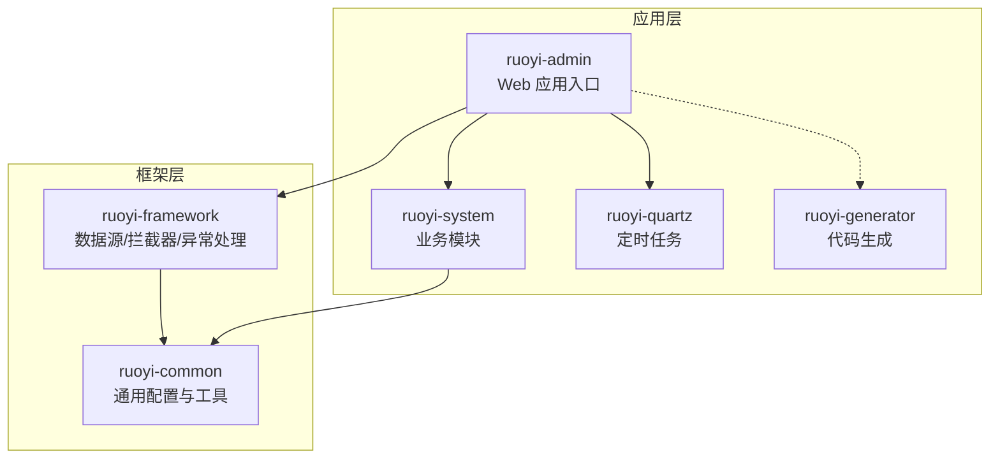
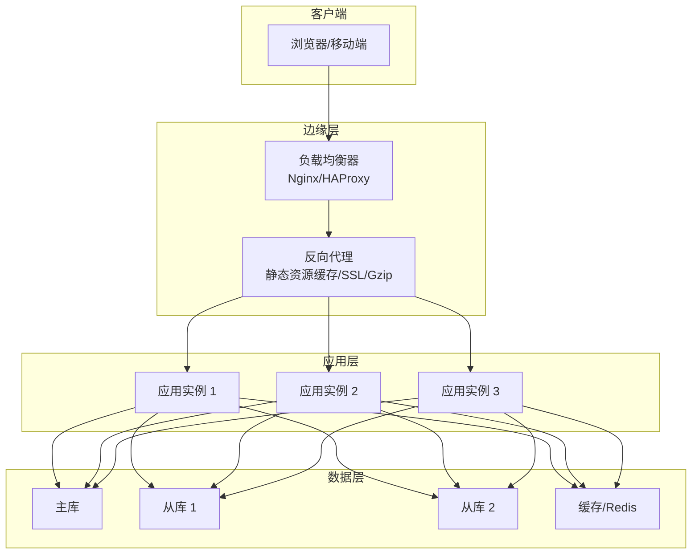
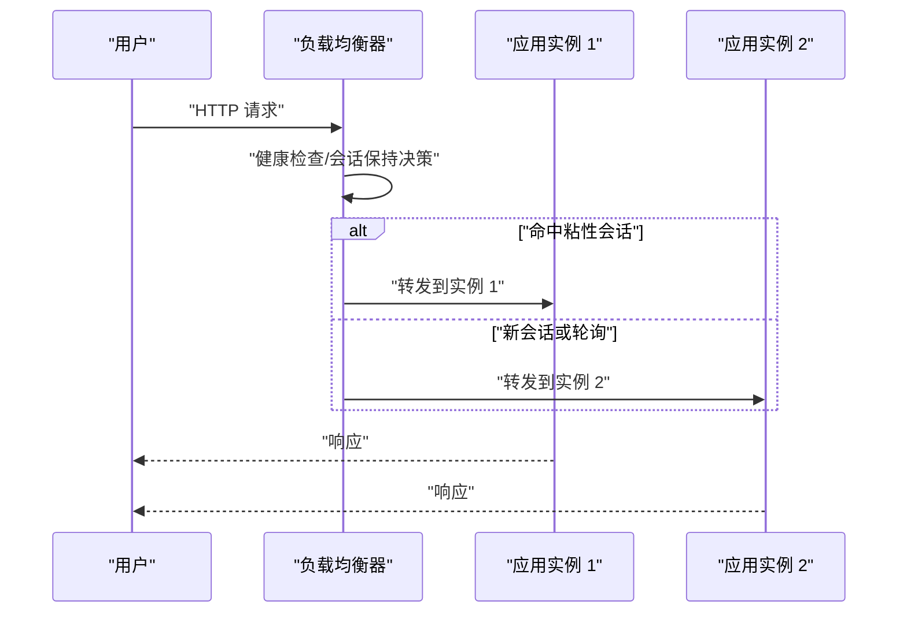
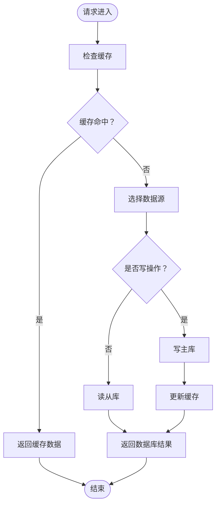
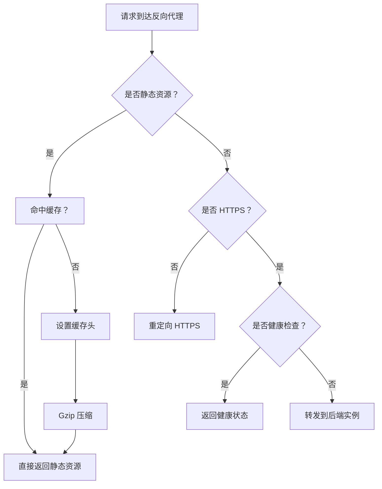
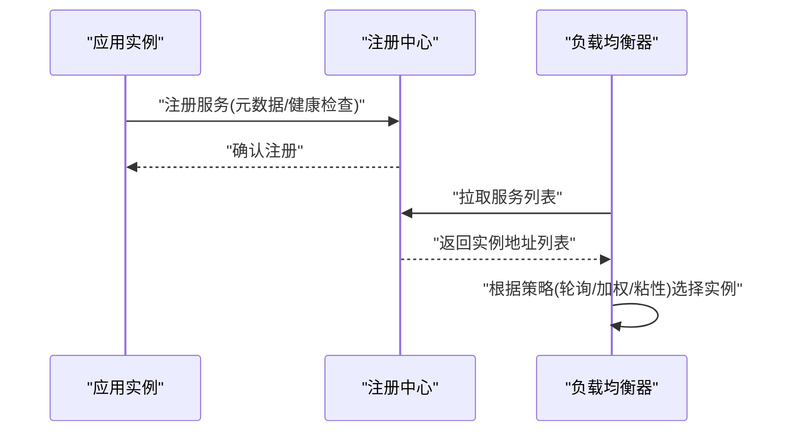
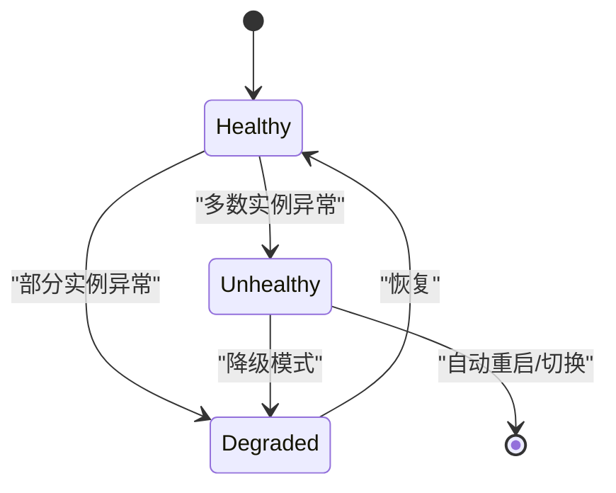
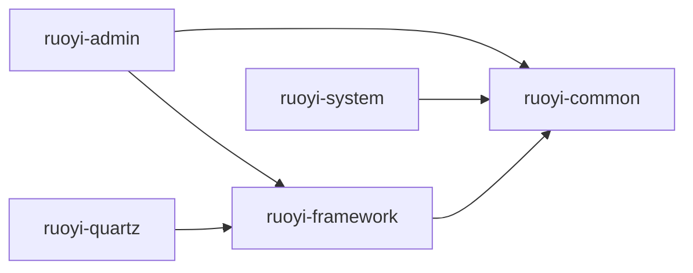

# 高可用部署

<cite>
**本文引用的文件**
- [application.yml](file://GenShin/RuoYi-master/ruoyi-admin/src/main/resources/application.yml)
- [application-druid.yml](file://GenShin/RuoYi-master/ruoyi-admin/src/main/resources/application-druid.yml)
- [DruidConfig.java](file://GenShin/RuoYi-master/ruoyi-framework/src/main/java/com/ruoyi/framework/config/DruidConfig.java)
- [MyBatisConfig.java](file://GenShin/RuoYi-master/ruoyi-framework/src/main/java/com/ruoyi/framework/config/MyBatisConfig.java)
- [RuoYiConfig.java](file://GenShin/RuoYi-master/ruoyi-common/src/main/java/com/ruoyi/common/config/RuoYiConfig.java)
- [DynamicDataSource.java](file://GenShin/RuoYi-master/ruoyi-framework/src/main/java/com/ruoyi/framework/datasource/DynamicDataSource.java)
- [DynamicDataSourceContextHolder.java](file://GenShin/RuoYi-master/ruoyi-common/src/main/java/com/ruoyi/common/config/datasource/DynamicDataSourceContextHolder.java)
- [DataSourceAspect.java](file://GenShin/RuoYi-master/ruoyi-framework/src/main/java/com/ruoyi/framework/aspectj/DataSourceAspect.java)
- [SwaggerConfig.java](file://GenShin/RuoYi-master/ruoyi-admin/src/main/java/com/ruoyi/web/core/config/SwaggerConfig.java)
- [GlobalExceptionHandler.java](file://GenShin/RuoYi-master/ruoyi-framework/src/main/java/com/ruoyi/framework/web/exception/GlobalExceptionHandler.java)
- [AsyncManager.java](file://GenShin/RuoYi-master/ruoyi-framework/src/main/java/com/ruoyi/framework/manager/AsyncManager.java)
- [AsyncFactory.java](file://GenShin/RuoYi-master/ruoyi-framework/src/main/java/com/ruoyi/framework/manager/factory/AsyncFactory.java)
- [ThreadPoolConfig.java](file://GenShin/RuoYi-master/ruoyi-common/src/main/java/com/ruoyi/common/config/thread/ThreadPoolConfig.java)
- [RuoYiApplication.java](file://GenShin/RuoYi-master/ruoyi-admin/src/main/java/com/ruoyi/RuoYiApplication.java)
- [RuoYiServletInitializer.java](file://GenShin/RuoYi-master/ruoyi-admin/src/main/java/com/ruoyi/RuoYiServletInitializer.java)
- [pom.xml](file://GenShin/RuoYi-master/pom.xml)
- [README.md](file://GenShin/RuoYi-master/README.md)
</cite>

## 目录
1. [简介](#简介)
2. [项目结构](#项目结构)
3. [核心组件](#核心组件)
4. [架构总览](#架构总览)
5. [详细组件分析](#详细组件分析)
6. [依赖关系分析](#依赖关系分析)
7. [性能考虑](#性能考虑)
8. [故障排查指南](#故障排查指南)
9. [结论](#结论)
10. [附录](#附录)

## 简介
本文件面向原神攻略系统（基于 RuoYi 框架）的高可用部署与运维，覆盖负载均衡、会话保持、健康检查、集群部署、反向代理优化、微服务注册发现、故障转移与自动恢复、性能调优以及监控告警等主题。内容结合仓库中现有配置与代码实现进行说明，并提供可落地的部署建议。

## 项目结构
系统采用多模块 Maven 结构，核心模块包括：
- ruoyi-admin：Web 应用入口与前端模板资源
- ruoyi-common：通用工具、常量、线程池配置等
- ruoyi-framework：框架层，包含数据源动态切换、MyBatis、Shiro、异常处理、异步任务管理等
- ruoyi-system：业务模块，包含角色、用户、字典、公告、监控日志等业务实体与 Mapper
- ruoyi-quartz：定时任务模块
- ruoyi-generator：代码生成模块

**图表来源**
- [pom.xml](file://GenShin/RuoYi-master/pom.xml)
- [RuoYiApplication.java](file://GenShin/RuoYi-master/ruoyi-admin/src/main/java/com/ruoyi/RuoYiApplication.java)

**章节来源**
- [pom.xml](file://GenShin/RuoYi-master/pom.xml)
- [README.md](file://GenShin/RuoYi-master/README.md)

## 核心组件
- 数据库连接与监控：通过 Druid 连接池配置与监控页面实现连接池状态可视化与性能指标采集
- 动态数据源：支持读写分离与多数据源路由，配合注解实现方法级数据源选择
- 异步任务与线程池：统一的异步任务管理与线程池配置，保障后台任务不阻塞主线程
- 全局异常处理：集中处理业务异常与系统异常，输出统一格式响应
- API 文档：集成 Swagger，便于接口测试与联调
- 应用启动：Spring Boot 启动类与 Servlet 初始化器

**章节来源**
- [application.yml](file://GenShin/RuoYi-master/ruoyi-admin/src/main/resources/application.yml)
- [application-druid.yml](file://GenShin/RuoYi-master/ruoyi-admin/src/main/resources/application-druid.yml)
- [DruidConfig.java](file://GenShin/RuoYi-master/ruoyi-framework/src/main/java/com/ruoyi/framework/config/DruidConfig.java)
- [DynamicDataSource.java](file://GenShin/RuoYi-master/ruoyi-framework/src/main/java/com/ruoyi/framework/datasource/DynamicDataSource.java)
- [DynamicDataSourceContextHolder.java](file://GenShin/RuoYi-master/ruoyi-common/src/main/java/com/ruoyi/common/config/datasource/DynamicDataSourceContextHolder.java)
- [DataSourceAspect.java](file://GenShin/RuoYi-master/ruoyi-framework/src/main/java/com/ruoyi/framework/aspectj/DataSourceAspect.java)
- [AsyncManager.java](file://GenShin/RuoYi-master/ruoyi-framework/src/main/java/com/ruoyi/framework/manager/AsyncManager.java)
- [AsyncFactory.java](file://GenShin/RuoYi-master/ruoyi-framework/src/main/java/com/ruoyi/framework/manager/factory/AsyncFactory.java)
- [ThreadPoolConfig.java](file://GenShin/RuoYi-master/ruoyi-common/src/main/java/com/ruoyi/common/config/thread/ThreadPoolConfig.java)
- [GlobalExceptionHandler.java](file://GenShin/RuoYi-master/ruoyi-framework/src/main/java/com/ruoyi/framework/web/exception/GlobalExceptionHandler.java)
- [SwaggerConfig.java](file://GenShin/RuoYi-master/ruoyi-admin/src/main/java/com/ruoyi/web/core/config/SwaggerConfig.java)
- [RuoYiApplication.java](file://GenShin/RuoYi-master/ruoyi-admin/src/main/java/com/ruoyi/RuoYiApplication.java)

## 架构总览
下图展示应用层、框架层与数据层的交互关系，以及高可用部署的关键节点（负载均衡、会话保持、健康检查、数据库主从与读写分离）：

**图表来源**
- [application.yml](file://GenShin/RuoYi-master/ruoyi-admin/src/main/resources/application.yml)
- [application-druid.yml](file://GenShin/RuoYi-master/ruoyi-admin/src/main/resources/application-druid.yml)
- [DynamicDataSource.java](file://GenShin/RuoYi-master/ruoyi-framework/src/main/java/com/ruoyi/framework/datasource/DynamicDataSource.java)

## 详细组件分析

### 负载均衡与会话保持
- Nginx 配置要点
  - 上游服务器组指向多个应用实例
  - 健康检查：基于 TCP/HTTP 探针，失败时剔除节点
  - 会话保持：基于 Cookie 或 IP 哈希，确保用户请求稳定落到同一实例
  - 反亲源：开启 proxy_set_header X-Real-IP/X-Forwarded-For，便于后端识别真实来源
- HAProxy 配置要点
  - 使用 check 选项进行健康检查
  - 使用 stick-table 实现基于客户端 IP 的会话粘性
  - 支持动态更新后端列表与权重

[本图为概念性流程示意，无需图表来源]

### 集群部署与高可用架构
- 多实例部署
  - 同构多实例：每个实例独立部署，共享配置中心与注册中心
  - 独立部署：不同实例运行在不同主机或容器中，通过负载均衡对外提供服务
- 数据库主从复制与读写分离
  - 主库负责写入；从库负责读取
  - 通过动态数据源路由，将只读操作分发至从库
  - 写操作强制走主库，避免读写冲突
- 缓存层
  - Redis 作为热点数据缓存，提升读性能
  - 缓存失效策略：TTL+主动失效，保证一致性

**图表来源**
- [DynamicDataSource.java](file://GenShin/RuoYi-master/ruoyi-framework/src/main/java/com/ruoyi/framework/datasource/DynamicDataSource.java)
- [DynamicDataSourceContextHolder.java](file://GenShin/RuoYi-master/ruoyi-common/src/main/java/com/ruoyi/common/config/datasource/DynamicDataSourceContextHolder.java)
- [application.yml](file://GenShin/RuoYi-master/ruoyi-admin/src/main/resources/application.yml)

### 反向代理优化
- 静态资源缓存
  - 对 CSS/JS/PNG 等静态资源设置长缓存策略
  - 版本化文件名或查询串，实现缓存失效
- SSL 证书
  - 使用 Let's Encrypt 或商业证书，启用 TLS 1.2+
  - 强制 HTTPS 重定向
- Gzip 压缩
  - 对文本类资源启用 gzip/br 压缩，降低带宽占用
- 健康检查路径
  - 在反向代理层暴露健康检查端点，供 LB/探针调用

[本图为概念性流程示意，无需图表来源]

### 微服务注册与发现
- 注册中心选型
  - Eureka：简单易用，适合小型到中型微服务场景
  - Consul：提供服务发现、健康检查、KV 存储与多数据中心能力
- 集成步骤
  - 在应用配置中启用服务发现与健康检查
  - 定义服务元数据（名称、版本、端口、健康检查路径）
  - 负载均衡器从注册中心拉取服务列表并动态更新

[本图为概念性流程示意，无需图表来源]

### 故障转移与自动恢复
- 应用重启策略
  - 使用进程管理器（如 systemd/docker）实现自动重启
  - 设置重启间隔与最大重启次数，避免雪崩效应
- 数据库故障切换
  - 主库不可用时，动态切换到从库；恢复后自动切回主库
  - 使用半同步复制与超时重试，平衡一致性与可用性
- 健康检查与熔断
  - LB/探针定期探测后端健康状态
  - 失败阈值触发熔断，流量切换至备用实例

[本图为概念性状态示意，无需图表来源]

### 性能调优建议
- JVM 参数优化
  - 堆大小：根据实例内存与 GC 行为调整新生代/老年代比例
  - GC 策略：优先选择低停顿收集器（如 G1/Parallel），开启自适应停顿目标
  - JIT 优化：启用内联与逃逸分析，减少对象分配
- 数据库连接池
  - 连接池大小：按并发请求数与数据库承载能力设定
  - 超时与重试：合理设置连接超时、查询超时与自动重试次数
  - 监控：开启慢查询日志与连接池指标上报
- 缓存策略
  - LRU/TTL：热点数据使用短 TTL，冷数据使用长 TTL
  - 多级缓存：本地缓存+分布式缓存，降低跨网络访问
- 异步与线程池
  - 合理设置线程池核心/最大线程数与队列长度
  - 分离 CPU 密集型与 IO 密集型任务，避免相互阻塞

**章节来源**
- [application-druid.yml](file://GenShin/RuoYi-master/ruoyi-admin/src/main/resources/application-druid.yml)
- [DruidConfig.java](file://GenShin/RuoYi-master/ruoyi-framework/src/main/java/com/ruoyi/framework/config/DruidConfig.java)
- [ThreadPoolConfig.java](file://GenShin/RuoYi-master/ruoyi-common/src/main/java/com/ruoyi/common/config/thread/ThreadPoolConfig.java)
- [AsyncManager.java](file://GenShin/RuoYi-master/ruoyi-framework/src/main/java/com/ruoyi/framework/manager/AsyncManager.java)

### 监控告警体系
- 指标采集
  - 应用：QPS、响应时间、错误率、线程池队列长度、GC 次数与耗时
  - 数据库：连接数、慢查询、锁等待、主从延迟
  - 负载均衡：实例存活数、请求分布、健康检查失败数
- 告警策略
  - 阈值告警：超过预设阈值立即告警
  - 趋势告警：连续上升趋势触发预警
  - 服务不可用：实例长时间不可达触发紧急告警
- 可视化
  - 使用 Prometheus + Grafana 展示关键指标
  - 日志聚合：ELK/EFK 统一收集与检索

[本节为通用运维建议，无需章节来源]

## 依赖关系分析
- 模块依赖
  - ruoyi-admin 依赖 ruoyi-framework 与 ruoyi-common
  - ruoyi-system 依赖 ruoyi-common
  - ruoyi-quartz 依赖 ruoyi-framework
- 配置依赖
  - application.yml 为主配置，application-druid.yml 为 Druid 连接池扩展配置
  - MyBatisConfig 与 DruidConfig 提供 ORM 与连接池初始化
  - 动态数据源通过注解与上下文切换读写库

**图表来源**
- [pom.xml](file://GenShin/RuoYi-master/pom.xml)

**章节来源**
- [pom.xml](file://GenShin/RuoYi-master/pom.xml)
- [MyBatisConfig.java](file://GenShin/RuoYi-master/ruoyi-framework/src/main/java/com/ruoyi/framework/config/MyBatisConfig.java)
- [DruidConfig.java](file://GenShin/RuoYi-master/ruoyi-framework/src/main/java/com/ruoyi/framework/config/DruidConfig.java)

## 性能考虑
- 连接池与数据库
  - 合理设置最大连接数与空闲连接数，避免连接泄漏
  - 开启 SQL 监控与慢查询日志，定期优化热点 SQL
- 缓存与热点
  - 对高频读取的数据建立缓存，设置合理的过期策略
  - 使用本地缓存减少远程访问
- 异步化
  - 将非关键路径的任务异步执行，释放主线程
  - 控制线程池大小与队列长度，避免内存压力

[本节为通用指导，无需章节来源]

## 故障排查指南
- 常见问题定位
  - 应用启动失败：查看启动日志与端口占用情况
  - 数据库连接异常：检查连接池配置与主从连通性
  - 接口异常：通过全局异常处理器输出的统一格式快速定位
- 快速恢复
  - 应用实例异常：重启单个实例，观察健康检查恢复情况
  - 数据库故障：切换到从库，修复主库后自动切回
- 日志与审计
  - 记录关键操作与异常堆栈，便于回溯

**章节来源**
- [GlobalExceptionHandler.java](file://GenShin/RuoYi-master/ruoyi-framework/src/main/java/com/ruoyi/framework/web/exception/GlobalExceptionHandler.java)
- [RuoYiApplication.java](file://GenShin/RuoYi-master/ruoyi-admin/src/main/java/com/ruoyi/RuoYiApplication.java)

## 结论
通过合理的负载均衡、会话保持与健康检查策略，结合数据库主从复制与读写分离、缓存与异步化优化，以及完善的监控告警体系，原神攻略系统可在高并发场景下实现高可用与高性能。部署时应优先保证网络与存储的可靠性，并持续优化连接池与线程池参数，以获得最佳用户体验。

## 附录
- 启动与打包
  - 使用 Maven 打包构建，支持多环境配置
  - 通过 Spring Boot 启动类启动应用
- 配置文件位置
  - application.yml：应用主配置
  - application-druid.yml：Druid 连接池扩展配置
- 关键类参考
  - RuoYiApplication：应用启动入口
  - RuoYiServletInitializer：Servlet 容器初始化
  - SwaggerConfig：API 文档配置
  - AsyncFactory/AsyncManager：异步任务工厂与管理器

**章节来源**
- [RuoYiApplication.java](file://GenShin/RuoYi-master/ruoyi-admin/src/main/java/com/ruoyi/RuoYiApplication.java)
- [RuoYiServletInitializer.java](file://GenShin/RuoYi-master/ruoyi-admin/src/main/java/com/ruoyi/RuoYiServletInitializer.java)
- [SwaggerConfig.java](file://GenShin/RuoYi-master/ruoyi-admin/src/main/java/com/ruoyi/web/core/config/SwaggerConfig.java)
- [AsyncFactory.java](file://GenShin/RuoYi-master/ruoyi-framework/src/main/java/com/ruoyi/framework/manager/factory/AsyncFactory.java)
- [AsyncManager.java](file://GenShin/RuoYi-master/ruoyi-framework/src/main/java/com/ruoyi/framework/manager/AsyncManager.java)