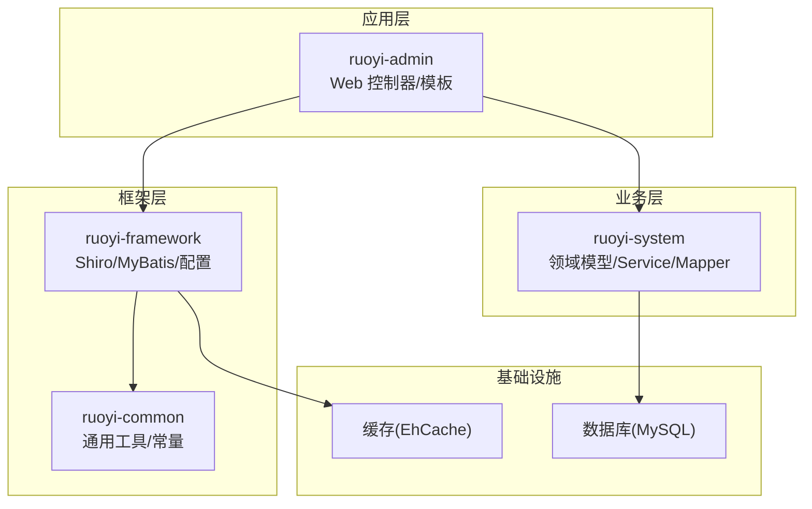
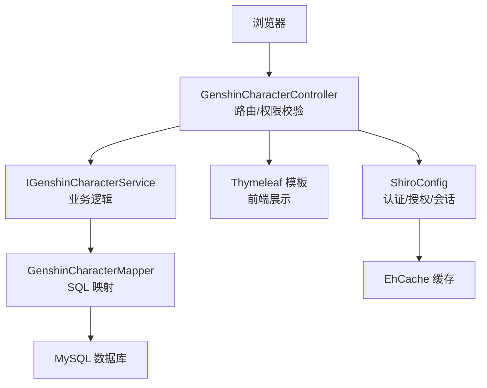
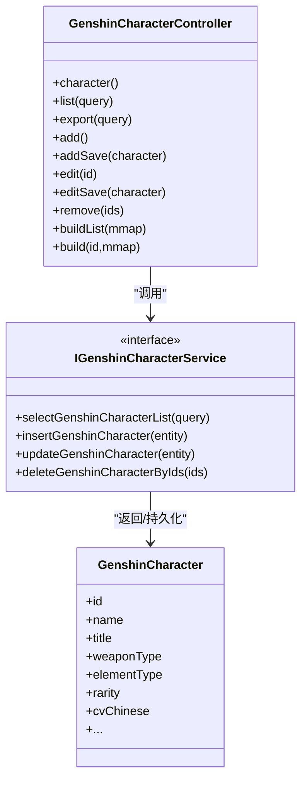
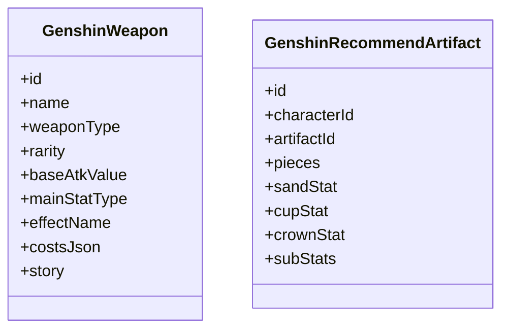
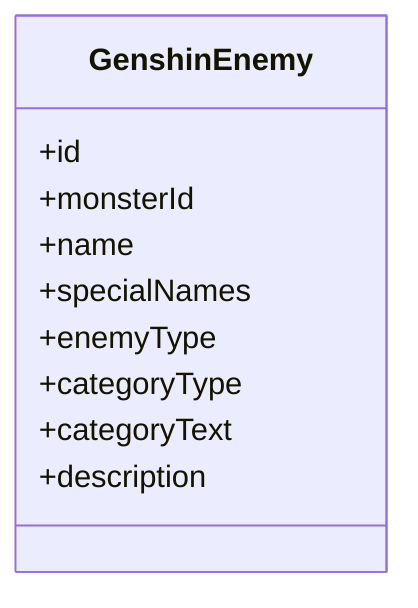
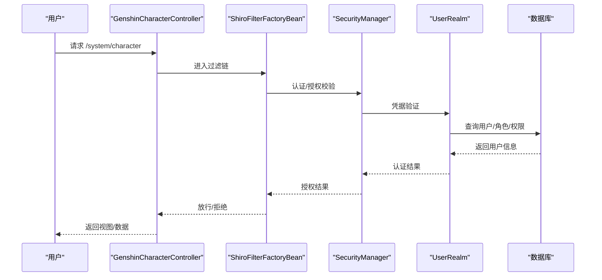
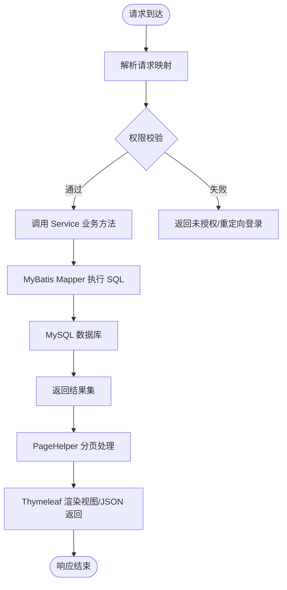
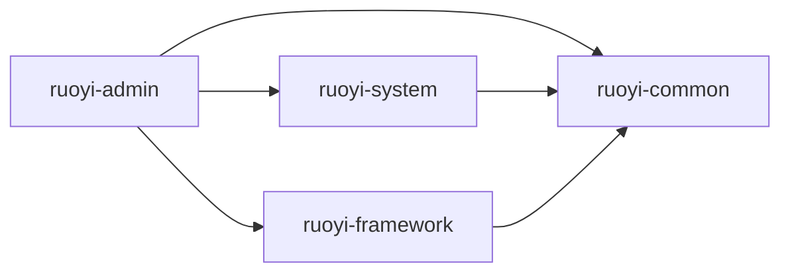

# 项目概述

<cite>
**本文引用的文件**
- [README.md](file://README.md)
- [GENSHIN_MODULE_GUIDE.md](file://GENSHIN_MODULE_GUIDE.md)
- [pom.xml](file://pom.xml)
- [application.yml](file://ruoyi-admin/src/main/resources/application.yml)
- [GenshinCharacter.java](file://ruoyi-system/src/main/java/com/ruoyi/system/domain/GenshinCharacter.java)
- [GenshinEnemy.java](file://ruoyi-system/src/main/java/com/ruoyi/system/domain/GenshinEnemy.java)
- [GenshinWeapon.java](file://ruoyi-system/src/main/java/com/ruoyi/system/domain/GenshinWeapon.java)
- [GenshinRecommendArtifact.java](file://ruoyi-system/src/main/java/com/ruoyi/system/domain/GenshinRecommendArtifact.java)
- [GenshinCharacterController.java](file://ruoyi-admin/src/main/java/com/ruoyi/web/controller/system/GenshinCharacterController.java)
- [ShiroConfig.java](file://ruoyi-framework/src/main/java/com/ruoyi/framework/config/ShiroConfig.java)
- [MyBatisConfig.java](file://ruoyi-framework/src/main/java/com/ruoyi/framework/config/MyBatisConfig.java)
</cite>

## 目录
1. [引言](#引言)
2. [项目结构](#项目结构)
3. [核心组件](#核心组件)
4. [架构总览](#架构总览)
5. [详细组件分析](#详细组件分析)
6. [依赖分析](#依赖分析)
7. [性能考虑](#性能考虑)
8. [故障排查指南](#故障排查指南)
9. [结论](#结论)
10. [附录](#附录)

## 引言
本项目是在 RuoYi 企业级开发框架基础上扩展的“原神攻略系统”，旨在为《原神》玩家与内容运营人员提供一套完整的攻略管理平台。系统围绕角色、武器、圣遗物、敌人等核心数据，提供角色管理、武器推荐、圣遗物搭配、敌人信息管理等功能模块，并通过权限控制与数据持久化保障系统的安全性与可维护性。

本项目采用前后端同构的 Thymeleaf 模板方案，结合 Spring Boot、MyBatis、Apache Shiro 等技术栈，形成稳定的企业级开发基座。通过模块化拆分与清晰的分层设计，既满足快速迭代的需求，又便于后续扩展更多原神相关内容（如配队推荐、角色培养路线、掉落材料统计等）。

## 项目结构
项目采用 Maven 多模块结构，核心模块包括：
- ruoyi-admin：Web 控制层与前端模板资源
- ruoyi-framework：框架支撑（安全、ORM、配置等）
- ruoyi-system：业务领域模型、Mapper、Service、Controller
- ruoyi-common：通用工具、常量、实体基类
- ruoyi-quartz、ruoyi-generator：定时任务与代码生成（可选）

图表来源
- [pom.xml:208-216](file://pom.xml#L208-L216)
- [application.yml:1-154](file://ruoyi-admin/src/main/resources/application.yml#L1-L154)

章节来源
- [pom.xml:208-216](file://pom.xml#L208-L216)
- [application.yml:1-154](file://ruoyi-admin/src/main/resources/application.yml#L1-L154)

## 核心组件
- 角色管理：提供角色基础信息的增删改查、导出、培养路线视图等能力
- 武器推荐：基于角色推荐适配的武器列表
- 圣遗物推荐：按角色推荐圣遗物套装与主副词条配置
- 敌人信息管理：怪物基础信息、类型、分类、描述等
- 权限与安全：基于 Apache Shiro 的认证授权、会话管理、记住我、验证码等
- 数据持久化：MyBatis ORM 映射与分页插件集成

章节来源
- [GENSHIN_MODULE_GUIDE.md:5-16](file://GENSHIN_MODULE_GUIDE.md#L5-L16)
- [GenshinCharacterController.java:38-198](file://ruoyi-admin/src/main/java/com/ruoyi/web/controller/system/GenshinCharacterController.java#L38-L198)
- [ShiroConfig.java:49-449](file://ruoyi-framework/src/main/java/com/ruoyi/framework/config/ShiroConfig.java#L49-L449)
- [MyBatisConfig.java:32-132](file://ruoyi-framework/src/main/java/com/ruoyi/framework/config/MyBatisConfig.java#L32-L132)

## 架构总览
系统采用经典的三层架构（表现层/业务层/数据访问层），配合 Spring Boot 自动装配与 RuoYi 框架提供的统一安全与数据访问能力，形成高内聚、低耦合的模块化体系。

图表来源
- [GenshinCharacterController.java:38-198](file://ruoyi-admin/src/main/java/com/ruoyi/web/controller/system/GenshinCharacterController.java#L38-L198)
- [ShiroConfig.java:296-346](file://ruoyi-framework/src/main/java/com/ruoyi/framework/config/ShiroConfig.java#L296-L346)
- [MyBatisConfig.java:116-131](file://ruoyi-framework/src/main/java/com/ruoyi/framework/config/MyBatisConfig.java#L116-L131)

## 详细组件分析

### 角色管理模块
- 功能职责：角色基础信息管理、角色培养路线聚合视图（武器/圣遗物/配队/天赋材料）
- 关键类与职责：
  - GenshinCharacterController：负责角色列表、新增、编辑、删除、导出、培养路线聚合
  - GenshinCharacter：角色实体，包含武器类型、元素、星级、CV 等字段
  - IGenshinCharacterService：角色业务接口
  - GenshinCharacterMapper：角色数据访问映射
- 前端模板：character.html、build.html、buildList.html

图表来源
- [GenshinCharacterController.java:38-198](file://ruoyi-admin/src/main/java/com/ruoyi/web/controller/system/GenshinCharacterController.java#L38-L198)
- [GenshinCharacter.java:14-383](file://ruoyi-system/src/main/java/com/ruoyi/system/domain/GenshinCharacter.java#L14-L383)

章节来源
- [GenshinCharacterController.java:38-198](file://ruoyi-admin/src/main/java/com/ruoyi/web/controller/system/GenshinCharacterController.java#L38-L198)
- [GenshinCharacter.java:14-383](file://ruoyi-system/src/main/java/com/ruoyi/system/domain/GenshinCharacter.java#L14-L383)

### 武器与圣遗物推荐
- 武器信息：包含武器类型、星级、基础攻击力、主副属性、突破材料 JSON、故事等
- 圣遗物推荐：按角色推荐套装 ID、件套需求、沙漏/杯子/头冠主词条、副词条优先级

图表来源
- [GenshinWeapon.java:16-316](file://ruoyi-system/src/main/java/com/ruoyi/system/domain/GenshinWeapon.java#L16-L316)
- [GenshinRecommendArtifact.java:14-163](file://ruoyi-system/src/main/java/com/ruoyi/system/domain/GenshinRecommendArtifact.java#L14-L163)

章节来源
- [GenshinWeapon.java:16-316](file://ruoyi-system/src/main/java/com/ruoyi/system/domain/GenshinWeapon.java#L16-L316)
- [GenshinRecommendArtifact.java:14-163](file://ruoyi-system/src/main/java/com/ruoyi/system/domain/GenshinRecommendArtifact.java#L14-L163)

### 敌人信息管理
- 敌人实体包含怪物内部 ID、名称、特殊名称、类型、分类、描述等字段
- 支持列表查询与基础管理

图表来源
- [GenshinEnemy.java:14-158](file://ruoyi-system/src/main/java/com/ruoyi/system/domain/GenshinEnemy.java#L14-L158)

章节来源
- [GenshinEnemy.java:14-158](file://ruoyi-system/src/main/java/com/ruoyi/system/domain/GenshinEnemy.java#L14-L158)

### 权限与安全流程
- 登录认证：ShiroConfig 配置登录地址、未授权地址、验证码、记住我、会话管理
- 过滤链：静态资源匿名访问、登录/注册验证码校验、CSRF 校验、在线会话同步、踢出重复登录
- 授权：基于注解的权限控制（如 system:character:*）

图表来源
- [ShiroConfig.java:296-346](file://ruoyi-framework/src/main/java/com/ruoyi/framework/config/ShiroConfig.java#L296-L346)
- [GenshinCharacterController.java:59-77](file://ruoyi-admin/src/main/java/com/ruoyi/web/controller/system/GenshinCharacterController.java#L59-L77)

章节来源
- [ShiroConfig.java:49-449](file://ruoyi-framework/src/main/java/com/ruoyi/framework/config/ShiroConfig.java#L49-L449)
- [GenshinCharacterController.java:59-77](file://ruoyi-admin/src/main/java/com/ruoyi/web/controller/system/GenshinCharacterController.java#L59-L77)

### 数据持久化与配置
- MyBatis 配置：自动扫描实体别名包、Mapper XML、全局配置文件
- 分页插件：PageHelper 集成，支持分页查询
- 数据源：通过 application.yml 配置（此处省略具体配置项）

图表来源
- [MyBatisConfig.java:116-131](file://ruoyi-framework/src/main/java/com/ruoyi/framework/config/MyBatisConfig.java#L116-L131)
- [application.yml:71-85](file://ruoyi-admin/src/main/resources/application.yml#L71-L85)

章节来源
- [MyBatisConfig.java:32-132](file://ruoyi-framework/src/main/java/com/ruoyi/framework/config/MyBatisConfig.java#L32-L132)
- [application.yml:71-85](file://ruoyi-admin/src/main/resources/application.yml#L71-L85)

## 依赖分析
- 技术选型与版本
  - Spring Boot：4.0.3（JDK 17+）
  - MyBatis：mybatis-spring-boot-starter 4.0.1
  - Shiro：2.1.0（Jakarta 分类器）
  - PageHelper：2.1.1
  - Druid：1.2.28
  - Thymeleaf Shiro：thymeleaf-extras-shiro 2.1.0
  - SpringDoc OpenAPI：3.0.2
- 模块依赖：ruoyi-admin 依赖 ruoyi-framework、ruoyi-system、ruoyi-common；ruoyi-system 提供业务域与数据访问；ruoyi-framework 提供安全与数据访问配置

图表来源
- [pom.xml:184-204](file://pom.xml#L184-L204)

章节来源
- [pom.xml:14-34](file://pom.xml#L14-L34)
- [pom.xml:184-204](file://pom.xml#L184-L204)

## 性能考虑
- 连接池与监控：使用 Druid 连接池与监控页面，便于定位慢查询与连接瓶颈
- 缓存策略：Shiro 使用 EhCache 管理会话与授权缓存，降低数据库压力
- 分页优化：PageHelper 分页减少大数据量查询负载
- ORM 优化：MyBatis 原生 SQL 与 XML 映射，避免 N+1 查询，合理使用延迟加载与批量查询
- 前端模板：Thymeleaf 服务端渲染，减少首屏 JS 计算压力

## 故障排查指南
- 启动失败
  - 检查 JDK 版本与 Spring Boot 版本兼容性（JDK 17+）
  - 确认 Maven 依赖拉取完成，本地仓库无损坏
- 数据库问题
  - 确认 application.yml 中数据库配置正确
  - 确保已执行 genshin_module.sql 初始化脚本
- 权限与登录
  - 检查 Shiro 配置（登录地址、未授权地址、验证码开关）
  - 确认菜单与权限标识已在系统中配置（如 system:character:*）
- 404/路由问题
  - 检查 Controller 的 @RequestMapping 路径与前端模板路径
  - 确认权限注解与菜单权限一致

章节来源
- [GENSHIN_MODULE_GUIDE.md:146-167](file://GENSHIN_MODULE_GUIDE.md#L146-L167)
- [application.yml:86-124](file://ruoyi-admin/src/main/resources/application.yml#L86-L124)
- [ShiroConfig.java:296-346](file://ruoyi-framework/src/main/java/com/ruoyi/framework/config/ShiroConfig.java#L296-L346)

## 结论
本项目以 RuoYi 为企业级开发基座，结合 Spring Boot、MyBatis、Apache Shiro 等成熟技术，构建了面向原神攻略场景的管理平台。通过模块化设计与清晰的分层架构，系统具备良好的可维护性与扩展性，适合在团队协作与持续迭代中使用。建议后续逐步完善配队推荐、材料统计、用户收藏等高级功能，并引入更完善的测试与监控体系。

## 附录
- 适用场景
  - 原神玩家攻略资料管理与分享
  - 游戏运营方的内容管理与数据维护
  - 教育/培训场景的角色与玩法知识库
- 目标用户
  - 原神玩家（策略研究者、内容创作者）
  - 游戏运营与内容编辑
  - 二次开发工程师与实施顾问
- 技术优势
  - 企业级安全与权限体系（Shiro）
  - 稳定的 ORM 与分页能力（MyBatis/PageHelper）
  - 快速开发与可扩展的模块化结构（RuoYi）